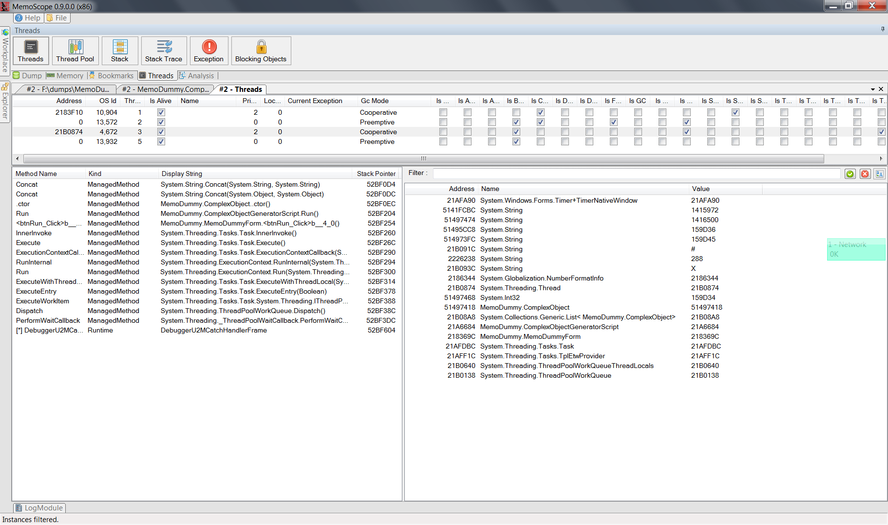
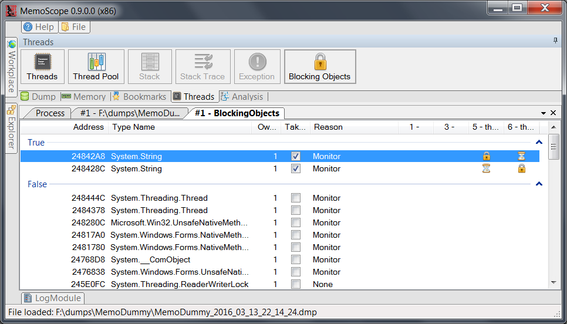

# MemoScope.Net   

 | Dump and analyze .Net applications memory
---------------------|-------------------------------------------
# Wiki
Please, read the [wiki](https://github.com/fremag/MemoScope.Net/wiki) to know everything about MemoScope.
Lot of pictures, animated gifs and some text for every major features.

# TLDR
## What it MemoScope.Net ?
It's a tool to analyze .Net process memory: it can dump an application's memory in a file and read it later.
The dump file contains all data (objects) and threads (state, stack, call stack)

MemoScope.Net will analyze the data and help you to find **memory leaks** and **deadlocks**
## Install
Get binaries from AppVeyor: [x86](https://ci.appveyor.com/api/projects/fremag/memoscope-net/artifacts/MemoScope_x86_Release.zip?job=Configuration%3A%20Release%3B%20Platform%3A%20x86) [x64](https://ci.appveyor.com/api/projects/fremag/memoscope-net/artifacts/MemoScope_x64_Release.zip?job=Configuration%3A%20Release%3B%20Platform%3A%20x64)

# Use cases
## Out of Memory
I know, with 64 bits apps it should not be an issue but computers only have a few a few Go so it may still happen if your application :
- is using too much memory (peak)
- runs for days and has a "slow" memory leak

## Dead lock
If your application is locked and you want to know where and why: dump the memory, display the threads status and blocking objects to see what thread is holding one that is waited by anoter thread.

## Hard to reproduce bug
Sometimes, users can do weird things with your application and you can't make it happen on your computer so ask the user to dump its application's memory to analyze it on your machine.

# Features
 
## Heap statistics

## Query instances

## Instances content and references

## Compare dumps

## Threads, Stacks

## Deadlocks

## Delegates

## Dump process memory

