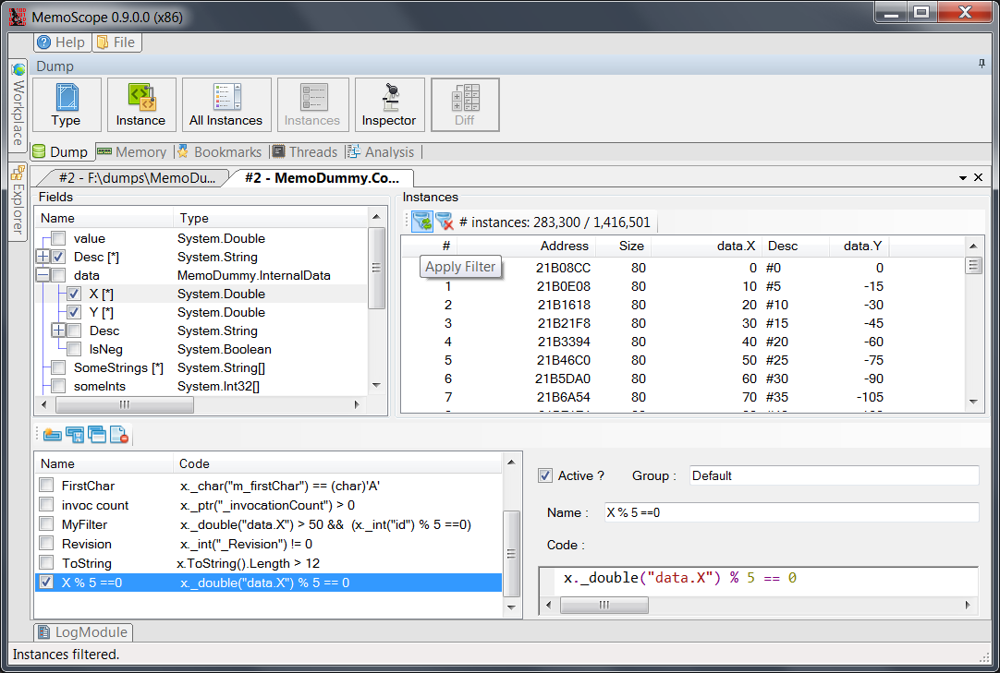
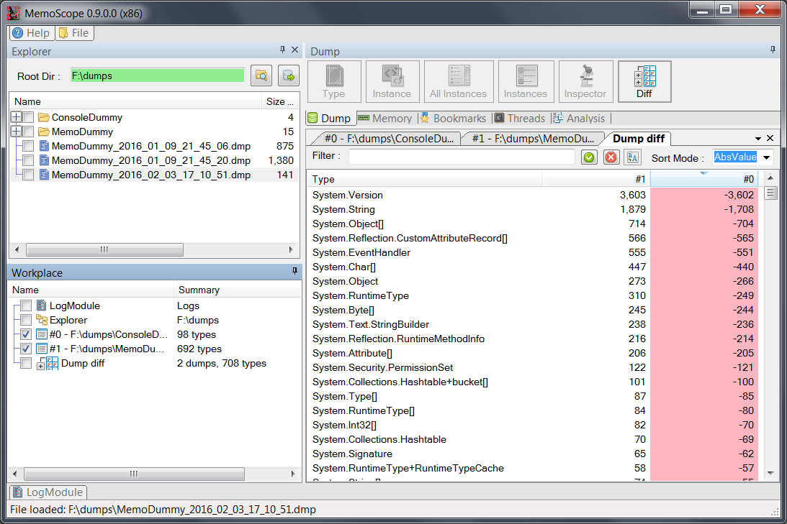
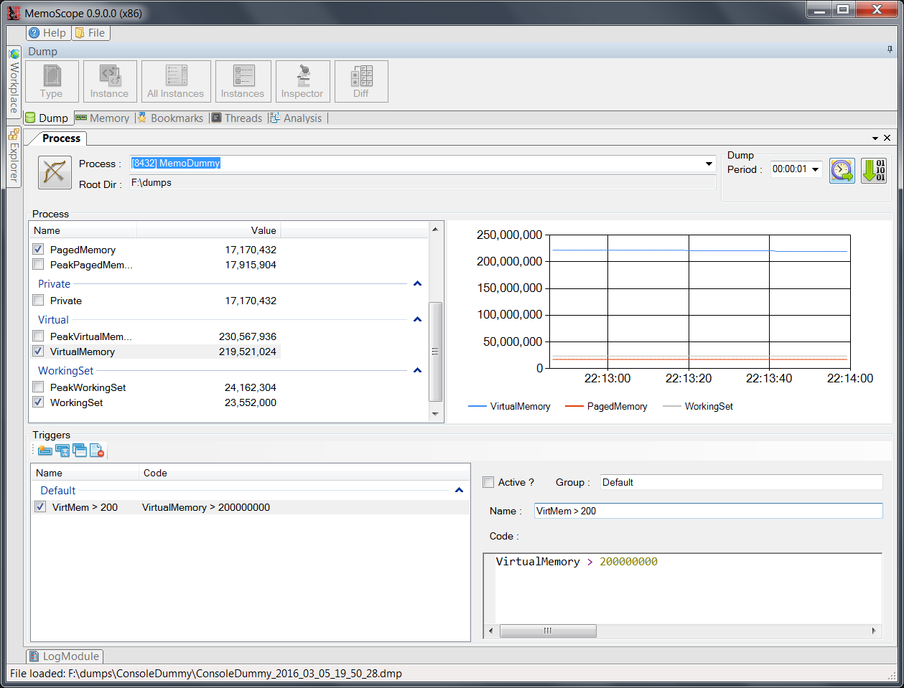

# MemoScope.Net 
[](https://ci.appveyor.com/project/fremag/memoscope-net)

 | Dump and analyze .Net applications memory
---------------------|-------------------------------------------
# Getting started
## What it MemoScope.Net ?
It's a tool to analyze .Net process memory: it can dump an application's memory in a file and read it later.
The dump file contains all data (objects) and threads (state, stack, call stack)

MemoScope.Net will analyze the data and help you to find **memory leaks** and **deadlocks**

## When should I use it ?
Here are some cases where MemoScope.Net is very  useful.

### Out of Memory
I know, with 64 bits apps it should not be an issue but computers only have a few a few Go so it may still happen if your application :
- is using too much memory (peak)
- runs for days and has a "slow" memory leak

### Dead lock
If your application is locked and you want to know where and why: dump the memory, display the threads status and blocking objects to see what thread is holding one that is waited by anoter thread.

### Hard to reproduce bug
Sometimes, users can do weird things with your application and you can't make it happen on your computer so ask the user to dump its application's memory to analyze it on your machine.

# Install
- clone the repository from GitHub and run the solution with Visual Studio 2015 (with .Net 4.6)
- get a version from [AppVeyor](https://ci.appveyor.com/project/fremag/memoscope-net):
 - Debug: [x86](https://ci.appveyor.com/api/projects/fremag/memoscope-net/artifacts/MemoScope_x86_Debug.zip?job=Configuration%3A%20Debug%3B%20Platform%3A%20x86) [x64](https://ci.appveyor.com/api/projects/fremag/memoscope-net/artifacts/MemoScope_x64_Debug.zip?job=Configuration%3A%20Debug%3B%20Platform%3A%20x64)
- Release: [x86](https://ci.appveyor.com/api/projects/fremag/memoscope-net/artifacts/MemoScope_x86_Release.zip?job=Configuration%3A%20Release%3B%20Platform%3A%20x86) [x64](https://ci.appveyor.com/api/projects/fremag/memoscope-net/artifacts/MemoScope_x64_Release.zip?job=Configuration%3A%20Release%3B%20Platform%3A%20x64)

# Licence
**Public Domain**

Do what you want with this software and source code.

The only important thing to know is that I can't be responsible for anything that could happen with it.
If your life partner leaves you, your computer explodes, your car is smashed by a meteor or even if Asmodeus appears in your room etc : 
**it can't be my fault**

# Features
 
## Heap statistics


## Query instances


## Instances content and references


## Compare dumps


## Threads, Stacks


## Deadlocks


## Delegates


## Dump process memory


## Memoscope API
Request a dump in your application code:
```C#
var client = new MemoScopeClient();
client.Open();
client.DumpMe();
```
# FAQ
##Is it a memory profiler ?
**No**: a memory profiler will record allocations to detect where an object has been created.
In a dump file, this information is not present.

**But**: MemoScope.Net shares many features with memory profilers: heap statistics, display object content and references, find duplicated strings etc

##Is it a debugger ?
**No**: you can **NOT** run the process step by step or add any breakpoint.
The dump file is static, nothing is dynamic.

**But**: you can see objects' content and call stacks so you can find why your process is locked or in an infinite loop for instance.

## Is it "better" than...
### WinDbg
**No**: some features are missing (scripts for instance) 

**But** it's way easier to use thanks to its: 
- nice dockable GUI
- no complex command line, almost everything can be done with the mouse
- advanced analysis (find event targets for instance)

### JetBrains' dotMemory 
**No**. I wish I could write something comparable to JetBrains products...

**But** MemoScope.Net is __**free**__ and you have the source code so you can extend it.

### Visual Studio ?
**Yes**. Visual Studio can open dump file and compare them but it's missing a lot of features that MemoScope.Net has. (See the list below)

## How can I help you ?
Send some issues: bug reports, missing features, feedback etc

## Why is your english so bad ?
Because I'm French. Please, help me to correct any spelling, grammar errors etc you could notice.

## Why Winforms and not WPF or UWP ?
Because it's good enough and I like  [ObjectListView](http://objectlistview.sourceforge.net/cs/index.html) and  [DockPanelSuite](http://dockpanelsuite.com/).

Ok the real reason: I don't know WPF and never had to use at work or had time to learn it.

## Is there a wiki ?
Not yet but I will write one when milestone 0.9.9 is released.

## Are you using it ?
Yes, I use it at work. 

My users/colleagues can run some simulations for days and they can set dozen of parameters with a lot of input data.
So memory issues happens often. I used to try to fix them with a memory profiler but sometimes I could not: it takes too long to reproduce the issue or I could not get the exact configuration/data they set in the application or they are working in another place I can't connect to. 

I taught them to dump the memory so now I  can analyze it on my machine and I could find a lof of memory leaks or peaks, bugs etc

# Thanks to...
* [Lee Culver](https://github.com/leculver) for his [ClrMd](https://github.com/Microsoft/clrmd) library, without it, MemoScope.Net would not exist.
* FatCow for their free [icons](http://www.fatcow.com/free-icons)
* Phillip Piper for [ObjectListView](http://objectlistview.sourceforge.net/cs/index.html). With it, it's so easy  to display tables and trees.
* [DockPanelSuite](http://dockpanelsuite.com/) contributors for their docking library
* Rupert Avery for [C# Expression Evaluator](https://csharpeval.codeplex.com/)
* [Jeff Cyr](https://github.com/JeffCyr) for [ClrMd.Extensions](https://github.com/JeffCyr/ClrMD.Extensions), even if I don't use it, I learnt a lot reading the source code (and I copy/pasted the ClrObject class !)
* [Jacob Slusser](https://github.com/jacobslusser) for its [ScintillaNet](https://github.com/jacobslusser/ScintillaNET) conmponent 
* Alois Kraus for his [article](http://geekswithblogs.net/akraus1/archive/2012/05/20/149699.aspx) about delegate internals
* [NLog](https://github.com/NLog/NLog) contributors 
