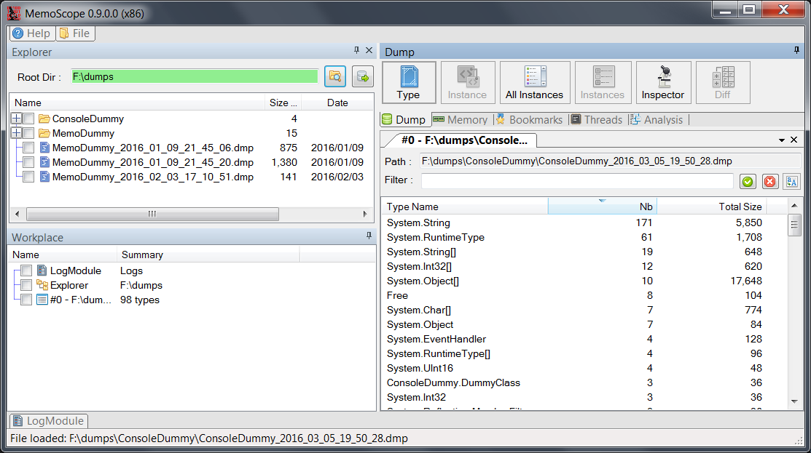

# MemoScope.Net

 | Dump and analyze .Net applications memory
---------------------|----------------------
# Getting started
## What it MemoScope.Net ?
It's a tool to analyze .Net process memory: it can dump an application's memory in a file and read it later.
The dump file contains all data (objects) and threads (state, stack, call stack)

It's very useful to find **memory leaks** and **deadlocks**

##Is it a memory profiler ?
No: a memory profiler will record allocations to detect where an object has been created.
In a dump file, this information is not present.

Yes: MemoScope.Net has many features present in memory profiler: heap statistics, display object content and references, find duplicated strings etc

#Is it a debugger ?
No: you can **NOT** run the process step by step or add any breakpoint.
The dump file is static,nothing is dynamic.

Yes: you can see object contents and call stacks so you can find why your process is locked or in an infinite loop for instance.

## Is it better then...
### WinDbg
No. Some features are missings (scripts for instance) but is easier to use: no funky commands, nice GUI etc

### JetBrains' dotMemory 
No. I wish I could write something comparable to JetBrains products...
But MemoScope.Net is free and you have the source code so you can extend it ;)

# Licence
Public Domain. Do what you want with this software and source code.
The only important thing to know is that I can't be responsible of anything that could happen with it.
If your life partner leaves you, your computer explodes, your car is smashed by a meteor or even if Asmodeus appears in your room.
**It can't be my fault**

# Features
 
## Heap statistics


## Query instances


## Instances content and references


## Compare dumps


## Threads, Stacks


## Deadlocks


## Delegates


## Dump process memory


## Memoscope API
Request a dump in your application code:
```C#
var client = new MemoScopeClient();
client.Open();
client.DumpMe();
```

# Thanks to...

* [Lee Culver](https://github.com/leculver) for his [ClrMd](https://github.com/Microsoft/clrmd) library, without it, MemoScope.Net would not exist.
* FatCow for their free [icons](http://www.fatcow.com/free-icons)
* Phillip Piper for [ObjectListView](http://objectlistview.sourceforge.net/cs/index.html). With it, it's so easy  to display tables and trees.
* [DockPanelSuite](http://dockpanelsuite.com/) contributors for their docking library
* Rupert Avery for [C# Expression Evaluator](https://csharpeval.codeplex.com/)
* [Jeff Cyr](https://github.com/JeffCyr) for [ClrMd.Extensions](https://github.com/JeffCyr/ClrMD.Extensions), even if I don't use it, I learnt a lot reading the source code (and I copy/pasted the ClrObject class !)
* [Jacob Slusser](https://github.com/jacobslusser) for its [ScintillaNet](https://github.com/jacobslusser/ScintillaNET) conmponent 
* Alois Kraus for his [article](http://geekswithblogs.net/akraus1/archive/2012/05/20/149699.aspx) about delegate internals
